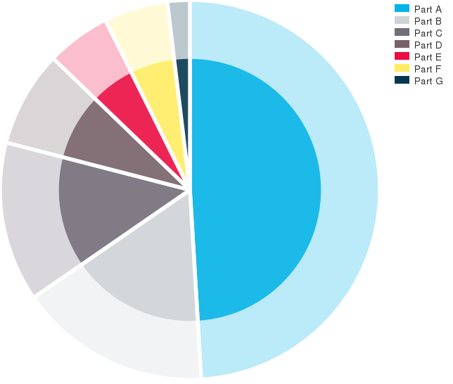

mithril_node_piechart
=====================

A simple SVG pie chart component for Mithril JS and NodeJS.



Usage
-----

```
// JSON containing data to create a basic SVG pie chart.
const data = {
	width: 	100,
	height: 100,
	parts:
	[
        { title: "Part A",    value : 180,  color: "#02B3E7" },
        { title: "Part B",    value:  60,   color: "#CFD3D6" },
        { title: "Part C",    value : 50,   color: "#736D79" },
        { title: "Part D",    value:  30,   color: "#776068" },
        { title: "Part E",    value : 20,   color: "#EB0D42" },
        { title: "Part F",    value : 20,   color: "#FFEC62" },
        { title: "Part G",    value : 7,    color: "#04374E" }
    ]
};

const ctrl = piechart.controller(data);
const view = piechart.view(ctrl);
```

Run the following command:

```
node test/test.js
````

It will generate a HTML file containing a SVG pie chart : [index.html](./public/index.html).


Options
--------

The controller takes a JSON containing data to create a pie chart.<br>
You should specify options like in usage example above.

| Option  | Description |
| ---- | ---- | ---- |
| **width** | Define the width viewport of the pie chart SVG. <br> Default: `0` |
| **height** | Define the height viewport of the pie chart SVG. <br> Default: `100` |
| **parts** | JSON defining each parts of the pie chart. <br> Example: <br> `{ title: "Part 1", value : 180, color: "#02B3E7" }` |
| edgeWidth | Pie chart edge width. <br> Default: `15` |
| delimiterColor | Pie chart parts delimiter color. <br> Default: `#fff` |
| delimiterOpacity | Pie chart parts delimiter opacity. <br> Default: `0.3` |
| delimiterWidth | Pie chart parts delimiter width. <br> Default: `1` |
